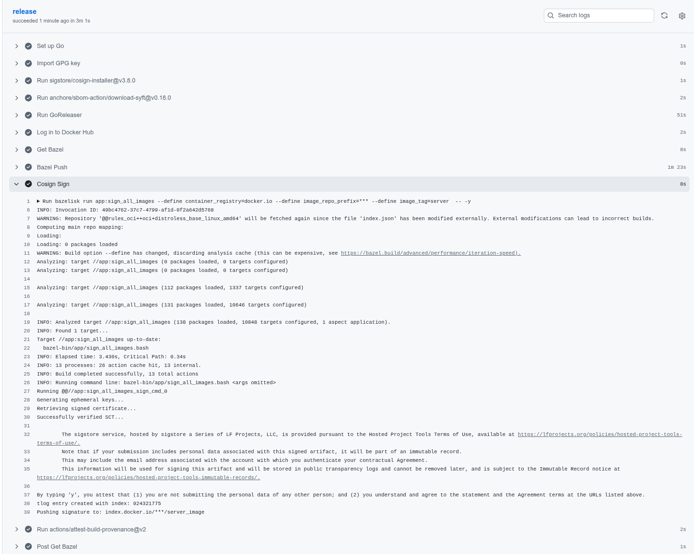
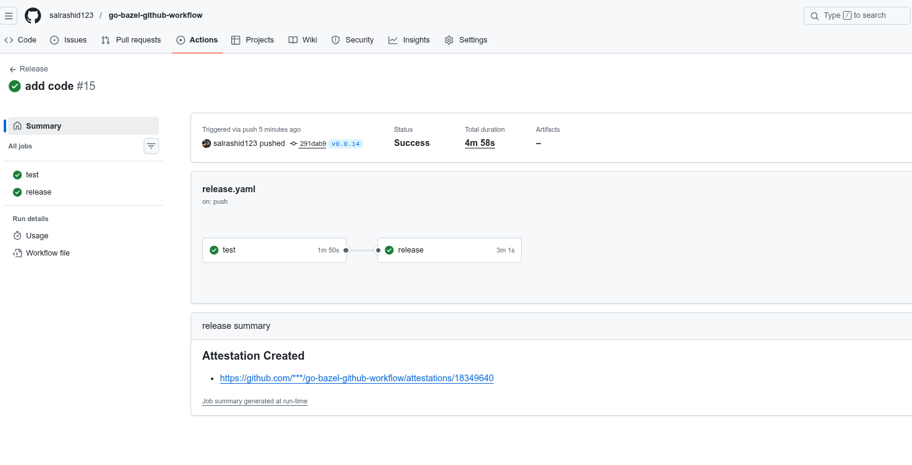

# Signed containers using Bazel and Github workflows 

Simple repo which:

1. builds a go application using `bazel`
2. creates an oci image using `bazel` 
3. pushes the image to dockerhub
4. uses `cosign sign` to sign the image and add an entry to sigstore transparency log
5. uses `cosign sign-blob` for each binary in the releases page.

All this is done within a github workflow so its auditable end-to-end

### References

- [Deterministic container hashes and container signing using Cosign, Bazel and Google Cloud Build](https://github.com/salrashid123/cosign_bazel_cloud_build)
- [Generate and verify cosign signatures using openssl](https://gist.github.com/salrashid123/4138d8b6ed5a89f5569e44eecbbb8fda)

Note, the cosign sample is attributed to [WFA Measurement System](https://github.com/world-federation-of-advertisers/cross-media-measurement)

### Build and Test locally

To run and test locally,

```bash
bazel run :gazelle -- update-repos -from_file=go.mod -prune=true -to_macro=repositories.bzl%go_repositories

#bazel run app:server -- -httpport :8080
bazelisk run app:server -- -httpport :8080

#bazel test app:go_default_test
bazelisk test app:go_default_test

# or using go directly
go test -v ./...
```

### Push the image to DockerHub

To build and test the image locally, you'll first need to edit [app/BUILD.bazel](app/BUILD.bazel) the `gen_rule` for `sign_binary` and `sign_checksum` to only use the local cert.

Then if you want to push, edit the `oci_push`, `push-image` target repo.

Note that the image below is a multi-arch oci image index which is what is ultimately signed.

```bash
bazelisk run app:push-image

export IMAGE="docker.io/salrashid123/server_image:server@sha256:c05263d2ff654c3a94243662440913f045075d59c436e2c69e9145ec2b87a321"

crane  manifest $IMAGE

  {
    "schemaVersion": 2,
    "mediaType": "application/vnd.oci.image.index.v1+json",
    "manifests": [
      {
        "mediaType": "application/vnd.oci.image.manifest.v1+json",
        "digest": "sha256:81f575aadc0246c94c8580b55550eda76d518c6a932a43e72d9cb4d9734d0b75",
        "size": 2938,
        "platform": {
          "os": "linux",
          "architecture": "amd64"
        }
      },
      {
        "mediaType": "application/vnd.oci.image.manifest.v1+json",
        "digest": "sha256:8055db12c63d96753dc89695a8e902a1d6d169caa3880177c2d8e277c8d10f1e",
        "size": 2938,
        "platform": {
          "os": "linux",
          "architecture": "arm64",
          "variant": "v8"
        }
      }
    ]
  }
```

Default image is posted to

* [https://hub.docker.com/r/salrashid123/server_image/tags](https://hub.docker.com/r/salrashid123/server_image/tags)

### Sign the image on dockerhub

If you want ot sign locally using bazel


```bash
bazelisk run app:sign_all_images --define container_registry=docker.io --define image_repo_prefix=salrashid123 --define image_tag=server -- -y
```

see [cosign sign](https://docs.sigstore.dev/cosign/signing/overview/)


### Verify the image

You can use `cosign` to  verify locally too:

```bash
export COSIGN_EXPERIMENTAL=1  
# for github workflow
cosign verify $IMAGE     --certificate-oidc-issuer https://token.actions.githubusercontent.com       --certificate-identity-regexp="https://github.com.*"

# for local
# cosign verify $IMAGE     --certificate-oidc-issuer https://github.com/login/oauth   --certificate-identity salrashid123@gmail.com 

# for google oidc
# cosign verify $IMAGE   --certificate-identity salrashid123@gmail.com  --certificate-oidc-issuer https://accounts.google.com
```

see [Verify image with user-provided trusted chain](https://docs.sigstore.dev/cosign/verifying/verify/)


### Github Workflow

If you want to test the full end to end workflow on github, you need to setup the github token and gpg signatures as shown in the `.github/workflows/` folder

```bash
git add -A
git commit -m "add code" -S -s
git push

export TAG=v0.0.30
git tag -a $TAG -m "Release $TAG" -s
git push origin $TAG
```



---

### Github Attestation

The github workflow also uses `goreleaser` to generate binarires (you can use bazel but i wanted to generate the [attestations](https://github.com/salrashid123/go-bazel-github-workflow/attestations/18349640) easily)



### Trace

#### Verify container image

Once the code is pushed, you can recall the entire signature from the log.

```bash
cosign verify $IMAGE     --certificate-oidc-issuer https://token.actions.githubusercontent.com   --certificate-identity-regexp="https://github.com.*"  | jq '.'

  Verification for index.docker.io/salrashid123/server_image@sha256:c05263d2ff654c3a94243662440913f045075d59c436e2c69e9145ec2b87a321 --
  The following checks were performed on each of these signatures:
    - The cosign claims were validated
    - Existence of the claims in the transparency log was verified offline
    - The code-signing certificate was verified using trusted certificate authority certificates
  [
    {
      "critical": {
        "identity": {
          "docker-reference": "index.docker.io/salrashid123/server_image"
        },
        "image": {
          "docker-manifest-digest": "sha256:c05263d2ff654c3a94243662440913f045075d59c436e2c69e9145ec2b87a321"
        },
        "type": "cosign container image signature"
      },
      "optional": {
        "1.3.6.1.4.1.57264.1.1": "https://token.actions.githubusercontent.com",
        "1.3.6.1.4.1.57264.1.2": "push",
        "1.3.6.1.4.1.57264.1.3": "7624bd5f279fb5d4700ea72c1b2373ee33960700",
        "1.3.6.1.4.1.57264.1.4": "Release",
        "1.3.6.1.4.1.57264.1.5": "salrashid123/go-bazel-github-workflow",
        "1.3.6.1.4.1.57264.1.6": "refs/tags/v0.0.30",
        "Bundle": {
          "SignedEntryTimestamp": "MEYCIQDII5GQ1+pEgHrOp/oRqFPvZ2Ovj/JDavgceyIq+HkgVwIhAP+yMH9VGh8BSNRsjipVqcUxViysHjFM8Mq3tJ1D7kua",
          "Payload": {
            "body": "eyJhcGlWZXJzaW9uIjoiMC4wLjEiLCJraW5kIjoiaGFzaGVkcmVrb3JkIiwic3BlYyI6eyJkYXRhIjp7Imhhc2giOnsiYWxnb3JpdGhtIjoic2hhMjU2IiwidmFsdWUiOiJkOGEwMzA3MTYwODBlNDUxMzlmZjBkNmQ4ZGU3NjQ5Y2M1MDBkYzM0ZmYyYjlkNjk5MjAwYzBhNWQ1NTA0NjRiIn19LCJzaWduYXR1cmUiOnsiY29udGVudCI6Ik1FVUNJRnhUNjNxQlNGTzVMb05rWFdQYjBFaGVJcUgxcXFQS0tveDlSakNXWklVNUFpRUFzc3dLbXFWSHNlRFdkNll0V1VZUVlsTExDTFRScXVDUUZiUnRnSjNGY2pjPSIsInB1YmxpY0tleSI6eyJjb250ZW50IjoiTFMwdExTMUNSVWRKVGlCRFJWSlVTVVpKUTBGVVJTMHRMUzB0Q2sxSlNVaE1ha05EUW5KVFowRjNTVUpCWjBsVlNsQTRUa2RxTVVOa1RsaFdla0V4VVdKM1RFMHlTMnR6TldkWmQwTm5XVWxMYjFwSmVtb3dSVUYzVFhjS1RucEZWazFDVFVkQk1WVkZRMmhOVFdNeWJHNWpNMUoyWTIxVmRWcEhWakpOVWpSM1NFRlpSRlpSVVVSRmVGWjZZVmRrZW1SSE9YbGFVekZ3WW01U2JBcGpiVEZzV2tkc2FHUkhWWGRJYUdOT1RXcFpkMDFxU1ROTlZHZDVUVVJSTWxkb1kwNU5hbGwzVFdwSk0wMVVaM3BOUkZFeVYycEJRVTFHYTNkRmQxbElDa3R2V2tsNmFqQkRRVkZaU1V0dldrbDZhakJFUVZGalJGRm5RVVZUY205aGJIRjZZVlpEVUVFMk1tazFWRVJMVTIwMFdFZFJkRlZHWlRaeFppdFNUMElLVDNGbWJWTnRXbGcwSzJ4NWRIQXhVWGhYYUZnd1kydEhibGRLV1ZCNVMzQkNlVlZaTXpCeGNHNUZNVWxQT0dsWE1FdFBRMEprVFhkbloxaFFUVUUwUndwQk1WVmtSSGRGUWk5M1VVVkJkMGxJWjBSQlZFSm5UbFpJVTFWRlJFUkJTMEpuWjNKQ1owVkdRbEZqUkVGNlFXUkNaMDVXU0ZFMFJVWm5VVlVyUjJoV0NtWjZZV000V0dWRVJXbE1TeTlRWW10eU5WQnlhbk5qZDBoM1dVUldVakJxUWtKbmQwWnZRVlV6T1ZCd2VqRlphMFZhWWpWeFRtcHdTMFpYYVhocE5Ga0tXa1E0ZDJSM1dVUldVakJTUVZGSUwwSkhNSGRoTkZwd1lVaFNNR05JVFRaTWVUbHVZVmhTYjJSWFNYVlpNamwwVEROT2FHSklTbWhqTW1od1drUkZlUXBOZVRsdVlua3hhVmxZY0d4aVF6RnVZVmhTYjJSWFNYUmtNamw1WVRKYWMySXpZM1pNYldSd1pFZG9NVmxwT1ROaU0wcHlXbTE0ZG1RelRYWmpiVlp6Q2xwWFJucGFVelUxV1ZjeGMxRklTbXhhYmsxMlpFZEdibU41T1RKTlF6UjNUR3BOZDAxRWEwZERhWE5IUVZGUlFtYzNPSGRCVVVWRlN6Sm9NR1JJUW5vS1QyazRkbVJIT1hKYVZ6UjFXVmRPTUdGWE9YVmplVFZ1WVZoU2IyUlhTakZqTWxaNVdUSTVkV1JIVm5Wa1F6VnFZakl3ZDBWbldVdExkMWxDUWtGSFJBcDJla0ZDUVdkUlJXTklWbnBoUkVFeVFtZHZja0puUlVWQldVOHZUVUZGUkVKRFp6Tk9ha2t3V1cxUk1WcHFTVE5QVjFwcFRsZFJNRTU2UVhkYVYwVXpDazF0VFhoWmFrbDZUbnBPYkZwVVRYcFBWRmwzVG5wQmQwMUNWVWREYVhOSFFWRlJRbWMzT0hkQlVWRkZRakZLYkdKSFZtaGpNbFYzVFhkWlMwdDNXVUlLUWtGSFJIWjZRVUpDVVZGc1l6SkdjMk50Um5waFIyeHJUVlJKZWt3eVpIWk1WMHBvWlcxV2MweFhaSEJrUjJneFdXa3hNMkl6U25KYWJYaDJaSHBCWmdwQ1oyOXlRbWRGUlVGWlR5OU5RVVZIUWtKR2VWcFhXbnBNTTFKb1dqTk5kbVJxUVhWTlF6UjZUVVJCTjBKbmIzSkNaMFZGUVZsUEwwMUJSVWxDUXpCTkNrc3lhREJrU0VKNlQyazRkbVJIT1hKYVZ6UjFXVmRPTUdGWE9YVmplVFZ1WVZoU2IyUlhTakZqTWxaNVdUSTVkV1JIVm5Wa1F6VnFZakl3ZDJWUldVc0tTM2RaUWtKQlIwUjJla0ZDUTFGU2NrUkhiRzlrU0ZKM1kzcHZka3d5WkhCa1IyZ3hXV2sxYW1JeU1IWmpNa1p6WTIxR2VtRkhiR3ROVkVsNlRESmtkZ3BNVjBwb1pXMVdjMHhYWkhCa1IyZ3hXV2t4TTJJelNuSmFiWGgyWkhrNGRWb3liREJoU0ZacFRETmtkbU50ZEcxaVJ6a3pZM2s1ZVZwWGVHeFpXRTVzQ2t4dWJHaGlWM2hCWTIxV2JXTjVPVEJaVjJSNlRETlpkMHhxUVhWTmVrRjNUMEZaUzB0M1dVSkNRVWRFZG5wQlFrTm5VWEZFUTJjelRtcEpNRmx0VVRFS1dtcEpNMDlYV21sT1YxRXdUbnBCZDFwWFJUTk5iVTE0V1dwSmVrNTZUbXhhVkUxNlQxUlpkMDU2UVhkTlFqQkhRMmx6UjBGUlVVSm5OemgzUVZGelJRcEVkM2RPV2pKc01HRklWbWxNVjJoMll6TlNiRnBFUWtsQ1oyOXlRbWRGUlVGWlR5OU5RVVZOUWtSdlRVOUhhREJrU0VKNlQyazRkbG95YkRCaFNGWnBDa3h0VG5aaVV6bDZXVmQ0ZVZsWVRtOWhWMUY0VFdwTmRsb3lPSFJaYlVZMldsZDNkRm95YkRCaFNGWnBURmhrZG1OdGRHMWlSemt6VFVSblIwTnBjMGNLUVZGUlFtYzNPSGRCVVRCRlMyZDNiMDU2V1hsT1IwcHJUbGRaZVU1NmJHMVphbFpyVGtSamQwMUhWbWhPZWtwcVRWZEplVTE2WTNwYVYxVjZUWHByTWdwTlJHTjNUVVJCYUVKbmIzSkNaMFZGUVZsUEwwMUJSVTlDUWsxTlJWaEtiRnB1VFhaa1IwWnVZM2s1TWsxRE5IZE1hazEzVFVKdlIwTnBjMGRCVVZGQ0NtYzNPSGRCVVRoRlJFRjNTMDFVUlRGTlJHTXhUbFJqTlU5VVFYWkNaMjl5UW1kRlJVRlpUeTlOUVVWUlFrTkZUVWd5YURCa1NFSjZUMms0ZGxveWJEQUtZVWhXYVV4dFRuWmlVemw2V1ZkNGVWbFlUbTloVjFGNFRXcE5kMGRCV1V0TGQxbENRa0ZIUkhaNlFVSkZVVkZMUkVGbmVFMVVSVEJQVkVFeFRrUkNOUXBDWjI5eVFtZEZSVUZaVHk5TlFVVlRRa2R6VFdGWGFEQmtTRUo2VDJrNGRsb3liREJoU0ZacFRHMU9kbUpUT1hwWlYzaDVXVmhPYjJGWFVYaE5hazEyQ2xveU9IUlpiVVkyV2xkM2RGb3liREJoU0ZacFRGaGtkbU50ZEcxaVJ6a3pUSGsxYm1GWVVtOWtWMGwyWkRJNWVXRXlXbk5pTTJSNlRETktiR0pIVm1nS1l6SlZkV1ZYUm5SaVJVSjVXbGRhZWt3elVtaGFNMDEyWkdwQmRVMUROSHBOUkVFMFFtZHZja0puUlVWQldVOHZUVUZGVkVKRGIwMUxSR015VFdwU2FRcGFSRlp0VFdwak5WcHRTVEZhUkZFelRVUkNiRmxVWTNsWmVrWnBUV3BOTTAweVZteE5lazAxVG1wQk0wMUVRWGRHUVZsTFMzZFpRa0pCUjBSMmVrRkNDa1pCVVVkRVFWSjNaRmhPYjAxSGQwZERhWE5IUVZGUlFtYzNPSGRCVWxWRldHZDRZMkZJVWpCalNFMDJUSGs1Ym1GWVVtOWtWMGwxV1RJNWRFd3pUbWdLWWtoS2FHTXlhSEJhUkVWNVRYazVibUo1TVdsWldIQnNZa014Ym1GWVVtOWtWMGwwWkRJNWVXRXlXbk5pTTJOMldWZE9NR0ZYT1hWamVUbDVaRmMxZWdwTWVrbDVUa1JyTkUxcWF6Qk9SR2N4VERKR01HUkhWblJqU0ZKNlRIcEZkMFpuV1V0TGQxbENRa0ZIUkhaNlFVSkdaMUZKUkVGYWQyUlhTbk5oVjAxM0NtZFpiMGREYVhOSFFWRlJRakZ1YTBOQ1FVbEZaa0ZTTmtGSVowRmtaMFJrVUZSQ2NYaHpZMUpOYlUxYVNHaDVXbHA2WTBOdmEzQmxkVTQwT0hKbUswZ0thVzVMUVV4NWJuVnFaMEZCUVZwNVoxWlBlR0ZCUVVGRlFYZENTRTFGVlVOSlIzSmtlRlJuYVVKek9WZG9kSEY2WlhoUlVuTldNRmRoWkhSVFJrVmlNd280YkhOWFN6aFdNMUJVTUdWQmFVVkJlamxTVDFjdmJtZ3ZObWh5VmtwV2VsVnllV2w1YzJkWlQyTk9OMDlOSzFaVGVtVnFjbGc1Um1zM2IzZERaMWxKQ2t0dldrbDZhakJGUVhkTlJHRkJRWGRhVVVsNFFVbHNWRWxuZUZabVRHY3hZbWw2YVM5V1ExQXZjVXRhUzFGNVpqVmFOWFZXTWsxR1NHSTRaV3dyZVZNS1ZtOWhjbVpGTURWTVRtcGphMGg2TjA5VVdpOWFkMGwzVld0V1prMDVhREJvTkdoeUwyRlFkVUZPVEdWdlVXY3hhMmROV0dJNFRteHlTVWRFWkhvd2RncHpjMnB0WkU1dU5IZGxhbTF3V21ZclpHa3dTRmhFTVV3S0xTMHRMUzFGVGtRZ1EwVlNWRWxHU1VOQlZFVXRMUzB0TFFvPSJ9fX19",
            "integratedTime": 1772216446,
            "logIndex": 1004096555,
            "logID": "c0d23d6ad406973f9559f3ba2d1ca01f84147d8ffc5b8445c224f98b9591801d"
          }
        },
        "Issuer": "https://token.actions.githubusercontent.com",
        "Subject": "https://github.com/salrashid123/go-bazel-github-workflow/.github/workflows/release.yaml@refs/tags/v0.0.30",
        "githubWorkflowName": "Release",
        "githubWorkflowRef": "refs/tags/v0.0.30",
        "githubWorkflowRepository": "salrashid123/go-bazel-github-workflow",
        "githubWorkflowSha": "7624bd5f279fb5d4700ea72c1b2373ee33960700",
        "githubWorkflowTrigger": "push"
      }
    }
  ]
```

if you decode the payload

```json
{
  "apiVersion": "0.0.1",
  "kind": "hashedrekord",
  "spec": {
    "data": {
      "hash": {
        "algorithm": "sha256",
        "value": "d8a030716080e45139ff0d6d8de7649cc500dc34ff2b9d699200c0a5d550464b"
      }
    },
    "signature": {
      "content": "MEUCIFxT63qBSFO5LoNkXWPb0EheIqH1qqPKKox9RjCWZIU5AiEAsswKmqVHseDWd6YtWUYQYlLLCLTRquCQFbRtgJ3Fcjc=",
      "publicKey": {
        "content": "LS0tLS1CRUdJTiBDRVJUSUZJQ0FURS0tLS0tCk1JSUhMakNDQnJTZ0F3SUJBZ0lVSlA4TkdqMUNkTlhWekExUWJ3TE0yS2tzNWdZd0NnWUlLb1pJemowRUF3TXcKTnpFVk1CTUdBMVVFQ2hNTWMybG5jM1J2Y21VdVpHVjJNUjR3SEFZRFZRUURFeFZ6YVdkemRHOXlaUzFwYm5SbApjbTFsWkdsaGRHVXdIaGNOTWpZd01qSTNNVGd5TURRMldoY05Nall3TWpJM01UZ3pNRFEyV2pBQU1Ga3dFd1lICktvWkl6ajBDQVFZSUtvWkl6ajBEQVFjRFFnQUVTcm9hbHF6YVZDUEE2Mmk1VERLU200WEdRdFVGZTZxZitST0IKT3FmbVNtWlg0K2x5dHAxUXhXaFgwY2tHbldKWVB5S3BCeVVZMzBxcG5FMUlPOGlXMEtPQ0JkTXdnZ1hQTUE0RwpBMVVkRHdFQi93UUVBd0lIZ0RBVEJnTlZIU1VFRERBS0JnZ3JCZ0VGQlFjREF6QWRCZ05WSFE0RUZnUVUrR2hWCmZ6YWM4WGVERWlMSy9QYmtyNVByanNjd0h3WURWUjBqQkJnd0ZvQVUzOVBwejFZa0VaYjVxTmpwS0ZXaXhpNFkKWkQ4d2R3WURWUjBSQVFIL0JHMHdhNFpwYUhSMGNITTZMeTluYVhSb2RXSXVZMjl0TDNOaGJISmhjMmhwWkRFeQpNeTluYnkxaVlYcGxiQzFuYVhSb2RXSXRkMjl5YTJac2IzY3ZMbWRwZEdoMVlpOTNiM0pyWm14dmQzTXZjbVZzClpXRnpaUzU1WVcxc1FISmxabk12ZEdGbmN5OTJNQzR3TGpNd01Ea0dDaXNHQVFRQmc3OHdBUUVFSzJoMGRIQnoKT2k4dmRHOXJaVzR1WVdOMGFXOXVjeTVuYVhSb2RXSjFjMlZ5WTI5dWRHVnVkQzVqYjIwd0VnWUtLd1lCQkFHRAp2ekFCQWdRRWNIVnphREEyQmdvckJnRUVBWU8vTUFFREJDZzNOakkwWW1RMVpqSTNPV1ppTldRME56QXdaV0UzCk1tTXhZakl6TnpObFpUTXpPVFl3TnpBd01CVUdDaXNHQVFRQmc3OHdBUVFFQjFKbGJHVmhjMlV3TXdZS0t3WUIKQkFHRHZ6QUJCUVFsYzJGc2NtRnphR2xrTVRJekwyZHZMV0poZW1Wc0xXZHBkR2gxWWkxM2IzSnJabXh2ZHpBZgpCZ29yQmdFRUFZTy9NQUVHQkJGeVpXWnpMM1JoWjNNdmRqQXVNQzR6TURBN0Jnb3JCZ0VFQVlPL01BRUlCQzBNCksyaDBkSEJ6T2k4dmRHOXJaVzR1WVdOMGFXOXVjeTVuYVhSb2RXSjFjMlZ5WTI5dWRHVnVkQzVqYjIwd2VRWUsKS3dZQkJBR0R2ekFCQ1FSckRHbG9kSFJ3Y3pvdkwyZHBkR2gxWWk1amIyMHZjMkZzY21GemFHbGtNVEl6TDJkdgpMV0poZW1Wc0xXZHBkR2gxWWkxM2IzSnJabXh2ZHk4dVoybDBhSFZpTDNkdmNtdG1iRzkzY3k5eVpXeGxZWE5sCkxubGhiV3hBY21WbWN5OTBZV2R6TDNZd0xqQXVNekF3T0FZS0t3WUJCQUdEdnpBQkNnUXFEQ2czTmpJMFltUTEKWmpJM09XWmlOV1EwTnpBd1pXRTNNbU14WWpJek56TmxaVE16T1RZd056QXdNQjBHQ2lzR0FRUUJnNzh3QVFzRQpEd3dOWjJsMGFIVmlMV2h2YzNSbFpEQklCZ29yQmdFRUFZTy9NQUVNQkRvTU9HaDBkSEJ6T2k4dloybDBhSFZpCkxtTnZiUzl6WVd4eVlYTm9hV1F4TWpNdloyOHRZbUY2Wld3dFoybDBhSFZpTFhkdmNtdG1iRzkzTURnR0Npc0cKQVFRQmc3OHdBUTBFS2d3b056WXlOR0prTldZeU56bG1ZalZrTkRjd01HVmhOekpqTVdJeU16Y3paV1V6TXprMgpNRGN3TURBaEJnb3JCZ0VFQVlPL01BRU9CQk1NRVhKbFpuTXZkR0ZuY3k5Mk1DNHdMak13TUJvR0Npc0dBUVFCCmc3OHdBUThFREF3S01URTFNRGMxTlRjNU9UQXZCZ29yQmdFRUFZTy9NQUVRQkNFTUgyaDBkSEJ6T2k4dloybDAKYUhWaUxtTnZiUzl6WVd4eVlYTm9hV1F4TWpNd0dBWUtLd1lCQkFHRHZ6QUJFUVFLREFneE1URTBPVEExTkRCNQpCZ29yQmdFRUFZTy9NQUVTQkdzTWFXaDBkSEJ6T2k4dloybDBhSFZpTG1OdmJTOXpZV3h5WVhOb2FXUXhNak12CloyOHRZbUY2Wld3dFoybDBhSFZpTFhkdmNtdG1iRzkzTHk1bmFYUm9kV0l2ZDI5eWEyWnNiM2R6TDNKbGJHVmgKYzJVdWVXRnRiRUJ5WldaekwzUmhaM012ZGpBdU1DNHpNREE0QmdvckJnRUVBWU8vTUFFVEJDb01LRGMyTWpSaQpaRFZtTWpjNVptSTFaRFEzTURCbFlUY3lZekZpTWpNM00yVmxNek01TmpBM01EQXdGQVlLS3dZQkJBR0R2ekFCCkZBUUdEQVJ3ZFhOb01Hd0dDaXNHQVFRQmc3OHdBUlVFWGd4Y2FIUjBjSE02THk5bmFYUm9kV0l1WTI5dEwzTmgKYkhKaGMyaHBaREV5TXk5bmJ5MWlZWHBsYkMxbmFYUm9kV0l0ZDI5eWEyWnNiM2N2WVdOMGFXOXVjeTl5ZFc1egpMekl5TkRrNE1qazBORGcxTDJGMGRHVnRjSFJ6THpFd0ZnWUtLd1lCQkFHRHZ6QUJGZ1FJREFad2RXSnNhV013CmdZb0dDaXNHQVFRQjFua0NCQUlFZkFSNkFIZ0FkZ0RkUFRCcXhzY1JNbU1aSGh5Wlp6Y0Nva3BldU40OHJmK0gKaW5LQUx5bnVqZ0FBQVp5Z1ZPeGFBQUFFQXdCSE1FVUNJR3JkeFRnaUJzOVdodHF6ZXhRUnNWMFdhZHRTRkViMwo4bHNXSzhWM1BUMGVBaUVBejlST1cvbmgvNmhyVkpWelVyeWl5c2dZT2NON09NK1ZTemVqclg5Rms3b3dDZ1lJCktvWkl6ajBFQXdNRGFBQXdaUUl4QUlsVElneFZmTGcxYml6aS9WQ1AvcUtaS1F5ZjVaNXVWMk1GSGI4ZWwreVMKVm9hcmZFMDVMTmpja0h6N09UWi9ad0l3VWtWZk05aDBoNGhyL2FQdUFOTGVvUWcxa2dNWGI4TmxySUdEZHowdgpzc2ptZE5uNHdlam1wWmYrZGkwSFhEMUwKLS0tLS1FTkQgQ0VSVElGSUNBVEUtLS0tLQo="
      }
    }
  }
}
```

the content is the public key

```bash
cat public.crt

-----BEGIN CERTIFICATE-----
MIIHLjCCBrSgAwIBAgIUJP8NGj1CdNXVzA1QbwLM2Kks5gYwCgYIKoZIzj0EAwMw
NzEVMBMGA1UEChMMc2lnc3RvcmUuZGV2MR4wHAYDVQQDExVzaWdzdG9yZS1pbnRl
cm1lZGlhdGUwHhcNMjYwMjI3MTgyMDQ2WhcNMjYwMjI3MTgzMDQ2WjAAMFkwEwYH
KoZIzj0CAQYIKoZIzj0DAQcDQgAESroalqzaVCPA62i5TDKSm4XGQtUFe6qf+ROB
OqfmSmZX4+lytp1QxWhX0ckGnWJYPyKpByUY30qpnE1IO8iW0KOCBdMwggXPMA4G
A1UdDwEB/wQEAwIHgDATBgNVHSUEDDAKBggrBgEFBQcDAzAdBgNVHQ4EFgQU+GhV
fzac8XeDEiLK/Pbkr5PrjscwHwYDVR0jBBgwFoAU39Ppz1YkEZb5qNjpKFWixi4Y
ZD8wdwYDVR0RAQH/BG0wa4ZpaHR0cHM6Ly9naXRodWIuY29tL3NhbHJhc2hpZDEy
My9nby1iYXplbC1naXRodWItd29ya2Zsb3cvLmdpdGh1Yi93b3JrZmxvd3MvcmVs
ZWFzZS55YW1sQHJlZnMvdGFncy92MC4wLjMwMDkGCisGAQQBg78wAQEEK2h0dHBz
Oi8vdG9rZW4uYWN0aW9ucy5naXRodWJ1c2VyY29udGVudC5jb20wEgYKKwYBBAGD
vzABAgQEcHVzaDA2BgorBgEEAYO/MAEDBCg3NjI0YmQ1ZjI3OWZiNWQ0NzAwZWE3
MmMxYjIzNzNlZTMzOTYwNzAwMBUGCisGAQQBg78wAQQEB1JlbGVhc2UwMwYKKwYB
BAGDvzABBQQlc2FscmFzaGlkMTIzL2dvLWJhemVsLWdpdGh1Yi13b3JrZmxvdzAf
BgorBgEEAYO/MAEGBBFyZWZzL3RhZ3MvdjAuMC4zMDA7BgorBgEEAYO/MAEIBC0M
K2h0dHBzOi8vdG9rZW4uYWN0aW9ucy5naXRodWJ1c2VyY29udGVudC5jb20weQYK
KwYBBAGDvzABCQRrDGlodHRwczovL2dpdGh1Yi5jb20vc2FscmFzaGlkMTIzL2dv
LWJhemVsLWdpdGh1Yi13b3JrZmxvdy8uZ2l0aHViL3dvcmtmbG93cy9yZWxlYXNl
LnlhbWxAcmVmcy90YWdzL3YwLjAuMzAwOAYKKwYBBAGDvzABCgQqDCg3NjI0YmQ1
ZjI3OWZiNWQ0NzAwZWE3MmMxYjIzNzNlZTMzOTYwNzAwMB0GCisGAQQBg78wAQsE
DwwNZ2l0aHViLWhvc3RlZDBIBgorBgEEAYO/MAEMBDoMOGh0dHBzOi8vZ2l0aHVi
LmNvbS9zYWxyYXNoaWQxMjMvZ28tYmF6ZWwtZ2l0aHViLXdvcmtmbG93MDgGCisG
AQQBg78wAQ0EKgwoNzYyNGJkNWYyNzlmYjVkNDcwMGVhNzJjMWIyMzczZWUzMzk2
MDcwMDAhBgorBgEEAYO/MAEOBBMMEXJlZnMvdGFncy92MC4wLjMwMBoGCisGAQQB
g78wAQ8EDAwKMTE1MDc1NTc5OTAvBgorBgEEAYO/MAEQBCEMH2h0dHBzOi8vZ2l0
aHViLmNvbS9zYWxyYXNoaWQxMjMwGAYKKwYBBAGDvzABEQQKDAgxMTE0OTA1NDB5
BgorBgEEAYO/MAESBGsMaWh0dHBzOi8vZ2l0aHViLmNvbS9zYWxyYXNoaWQxMjMv
Z28tYmF6ZWwtZ2l0aHViLXdvcmtmbG93Ly5naXRodWIvd29ya2Zsb3dzL3JlbGVh
c2UueWFtbEByZWZzL3RhZ3MvdjAuMC4zMDA4BgorBgEEAYO/MAETBCoMKDc2MjRi
ZDVmMjc5ZmI1ZDQ3MDBlYTcyYzFiMjM3M2VlMzM5NjA3MDAwFAYKKwYBBAGDvzAB
FAQGDARwdXNoMGwGCisGAQQBg78wARUEXgxcaHR0cHM6Ly9naXRodWIuY29tL3Nh
bHJhc2hpZDEyMy9nby1iYXplbC1naXRodWItd29ya2Zsb3cvYWN0aW9ucy9ydW5z
LzIyNDk4Mjk0NDg1L2F0dGVtcHRzLzEwFgYKKwYBBAGDvzABFgQIDAZwdWJsaWMw
gYoGCisGAQQB1nkCBAIEfAR6AHgAdgDdPTBqxscRMmMZHhyZZzcCokpeuN48rf+H
inKALynujgAAAZygVOxaAAAEAwBHMEUCIGrdxTgiBs9WhtqzexQRsV0WadtSFEb3
8lsWK8V3PT0eAiEAz9ROW/nh/6hrVJVzUryiysgYOcN7OM+VSzejrX9Fk7owCgYI
KoZIzj0EAwMDaAAwZQIxAIlTIgxVfLg1bizi/VCP/qKZKQyf5Z5uV2MFHb8el+yS
VoarfE05LNjckHz7OTZ/ZwIwUkVfM9h0h4hr/aPuANLeoQg1kgMXb8NlrIGDdz0v
ssjmdNn4wejmpZf+di0HXD1L
-----END CERTIFICATE-----
```


which includes

```bash
$  openssl x509 -in public.crt -noout -text


Certificate:
    Data:
        Version: 3 (0x2)
        Serial Number:
            24:ff:0d:1a:3d:42:74:d5:d5:cc:0d:50:6f:02:cc:d8:a9:2c:e6:06
        Signature Algorithm: ecdsa-with-SHA384
        Issuer: O=sigstore.dev, CN=sigstore-intermediate
        Validity
            Not Before: Feb 27 18:20:46 2026 GMT
            Not After : Feb 27 18:30:46 2026 GMT
        Subject: 
        Subject Public Key Info:
            Public Key Algorithm: id-ecPublicKey
                Public-Key: (256 bit)
                pub:
                    04:4a:ba:1a:96:ac:da:54:23:c0:eb:68:b9:4c:32:
                    92:9b:85:c6:42:d5:05:7b:aa:9f:f9:13:81:3a:a7:
                    e6:4a:66:57:e3:e9:72:b6:9d:50:c5:68:57:d1:c9:
                    06:9d:62:58:3f:22:a9:07:25:18:df:4a:a9:9c:4d:
                    48:3b:c8:96:d0
                ASN1 OID: prime256v1
                NIST CURVE: P-256
        X509v3 extensions:
            X509v3 Key Usage: critical
                Digital Signature
            X509v3 Extended Key Usage: 
                Code Signing
            X509v3 Subject Key Identifier: 
                F8:68:55:7F:36:9C:F1:77:83:12:22:CA:FC:F6:E4:AF:93:EB:8E:C7
            X509v3 Authority Key Identifier: 
                DF:D3:E9:CF:56:24:11:96:F9:A8:D8:E9:28:55:A2:C6:2E:18:64:3F
            X509v3 Subject Alternative Name: critical
                URI:https://github.com/salrashid123/go-bazel-github-workflow/.github/workflows/release.yaml@refs/tags/v0.0.30
            1.3.6.1.4.1.57264.1.1: 
                https://token.actions.githubusercontent.com
            1.3.6.1.4.1.57264.1.2: 
                push
            1.3.6.1.4.1.57264.1.3: 
                7624bd5f279fb5d4700ea72c1b2373ee33960700
            1.3.6.1.4.1.57264.1.4: 
                Release
            1.3.6.1.4.1.57264.1.5: 
                salrashid123/go-bazel-github-workflow
            1.3.6.1.4.1.57264.1.6: 
                refs/tags/v0.0.30
            1.3.6.1.4.1.57264.1.8: 
                .+https://token.actions.githubusercontent.com
            1.3.6.1.4.1.57264.1.9: 
                .ihttps://github.com/salrashid123/go-bazel-github-workflow/.github/workflows/release.yaml@refs/tags/v0.0.30
            1.3.6.1.4.1.57264.1.10: 
                .(7624bd5f279fb5d4700ea72c1b2373ee33960700
            1.3.6.1.4.1.57264.1.11: 
github-hosted   .
            1.3.6.1.4.1.57264.1.12: 
                .8https://github.com/salrashid123/go-bazel-github-workflow
            1.3.6.1.4.1.57264.1.13: 
                .(7624bd5f279fb5d4700ea72c1b2373ee33960700
            1.3.6.1.4.1.57264.1.14: 
                ..refs/tags/v0.0.30
            1.3.6.1.4.1.57264.1.15: 
                .
1150755799
            1.3.6.1.4.1.57264.1.16: 
                ..https://github.com/salrashid123
            1.3.6.1.4.1.57264.1.17: 
                ..11149054
            1.3.6.1.4.1.57264.1.18: 
                .ihttps://github.com/salrashid123/go-bazel-github-workflow/.github/workflows/release.yaml@refs/tags/v0.0.30
            1.3.6.1.4.1.57264.1.19: 
                .(7624bd5f279fb5d4700ea72c1b2373ee33960700
            1.3.6.1.4.1.57264.1.20: 
                ..push
            1.3.6.1.4.1.57264.1.21: 
                .\https://github.com/salrashid123/go-bazel-github-workflow/actions/runs/22498294485/attempts/1
            1.3.6.1.4.1.57264.1.22: 
                ..public
            CT Precertificate SCTs: 
                Signed Certificate Timestamp:
                    Version   : v1 (0x0)
                    Log ID    : DD:3D:30:6A:C6:C7:11:32:63:19:1E:1C:99:67:37:02:
                                A2:4A:5E:B8:DE:3C:AD:FF:87:8A:72:80:2F:29:EE:8E
                    Timestamp : Feb 27 18:20:46.042 2026 GMT
                    Extensions: none
                    Signature : ecdsa-with-SHA256
                                30:45:02:20:6A:DD:C5:38:22:06:CF:56:86:DA:B3:7B:
                                14:11:B1:5D:16:69:DB:52:14:46:F7:F2:5B:16:2B:C5:
                                77:3D:3D:1E:02:21:00:CF:D4:4E:5B:F9:E1:FF:A8:6B:
                                54:95:73:52:BC:A2:CA:C8:18:39:C3:7B:38:CF:95:4B:
                                37:A3:AD:7F:45:93:BA
    Signature Algorithm: ecdsa-with-SHA384
    Signature Value:
        30:65:02:31:00:89:53:22:0c:55:7c:b8:35:6e:2c:e2:fd:50:
        8f:fe:a2:99:29:0c:9f:e5:9e:6e:57:63:05:1d:bf:1e:97:ec:
        92:56:86:ab:7c:4d:39:2c:d8:dc:90:7c:fb:39:36:7f:67:02:
        30:52:45:5f:33:d8:74:87:88:6b:fd:a3:ee:00:d2:de:a1:08:
        35:92:03:17:6f:c3:65:ac:81:83:77:3d:2f:b2:c8:e6:74:d9:
        f8:c1:e8:e6:a5:97:fe:76:2d:07:5c:3d:4b
```


Now you can use `rekor-cli` to inspect the tlog entry

```bash
$ rekor-cli search --rekor_server https://rekor.sigstore.dev    --sha  d8a030716080e45139ff0d6d8de7649cc500dc34ff2b9d699200c0a5d550464b

  Found matching entries (listed by UUID):
  108e9186e8c5677a52ffdf85098fa091649539757799d0224961c6f5cb4a41071c0848f748b7deeb
```

for our log entry

```bash
$ rekor-cli get --rekor_server https://rekor.sigstore.dev    --uuid 108e9186e8c5677a52ffdf85098fa091649539757799d0224961c6f5cb4a41071c0848f748b7deeb 

LogID: c0d23d6ad406973f9559f3ba2d1ca01f84147d8ffc5b8445c224f98b9591801d
Index: 1004096555
IntegratedTime: 2026-02-27T18:20:46Z
UUID: 108e9186e8c5677a52ffdf85098fa091649539757799d0224961c6f5cb4a41071c0848f748b7deeb
Body: {
  "HashedRekordObj": {
    "data": {
      "hash": {
        "algorithm": "sha256",
        "value": "d8a030716080e45139ff0d6d8de7649cc500dc34ff2b9d699200c0a5d550464b"
      }
    },
    "signature": {
      "content": "MEUCIFxT63qBSFO5LoNkXWPb0EheIqH1qqPKKox9RjCWZIU5AiEAsswKmqVHseDWd6YtWUYQYlLLCLTRquCQFbRtgJ3Fcjc=",
      "publicKey": {
        "content": "LS0tLS1CRUdJTiBDRVJUSUZJQ0FURS0tLS0tCk1JSUhMakNDQnJTZ0F3SUJBZ0lVSlA4TkdqMUNkTlhWekExUWJ3TE0yS2tzNWdZd0NnWUlLb1pJemowRUF3TXcKTnpFVk1CTUdBMVVFQ2hNTWMybG5jM1J2Y21VdVpHVjJNUjR3SEFZRFZRUURFeFZ6YVdkemRHOXlaUzFwYm5SbApjbTFsWkdsaGRHVXdIaGNOTWpZd01qSTNNVGd5TURRMldoY05Nall3TWpJM01UZ3pNRFEyV2pBQU1Ga3dFd1lICktvWkl6ajBDQVFZSUtvWkl6ajBEQVFjRFFnQUVTcm9hbHF6YVZDUEE2Mmk1VERLU200WEdRdFVGZTZxZitST0IKT3FmbVNtWlg0K2x5dHAxUXhXaFgwY2tHbldKWVB5S3BCeVVZMzBxcG5FMUlPOGlXMEtPQ0JkTXdnZ1hQTUE0RwpBMVVkRHdFQi93UUVBd0lIZ0RBVEJnTlZIU1VFRERBS0JnZ3JCZ0VGQlFjREF6QWRCZ05WSFE0RUZnUVUrR2hWCmZ6YWM4WGVERWlMSy9QYmtyNVByanNjd0h3WURWUjBqQkJnd0ZvQVUzOVBwejFZa0VaYjVxTmpwS0ZXaXhpNFkKWkQ4d2R3WURWUjBSQVFIL0JHMHdhNFpwYUhSMGNITTZMeTluYVhSb2RXSXVZMjl0TDNOaGJISmhjMmhwWkRFeQpNeTluYnkxaVlYcGxiQzFuYVhSb2RXSXRkMjl5YTJac2IzY3ZMbWRwZEdoMVlpOTNiM0pyWm14dmQzTXZjbVZzClpXRnpaUzU1WVcxc1FISmxabk12ZEdGbmN5OTJNQzR3TGpNd01Ea0dDaXNHQVFRQmc3OHdBUUVFSzJoMGRIQnoKT2k4dmRHOXJaVzR1WVdOMGFXOXVjeTVuYVhSb2RXSjFjMlZ5WTI5dWRHVnVkQzVqYjIwd0VnWUtLd1lCQkFHRAp2ekFCQWdRRWNIVnphREEyQmdvckJnRUVBWU8vTUFFREJDZzNOakkwWW1RMVpqSTNPV1ppTldRME56QXdaV0UzCk1tTXhZakl6TnpObFpUTXpPVFl3TnpBd01CVUdDaXNHQVFRQmc3OHdBUVFFQjFKbGJHVmhjMlV3TXdZS0t3WUIKQkFHRHZ6QUJCUVFsYzJGc2NtRnphR2xrTVRJekwyZHZMV0poZW1Wc0xXZHBkR2gxWWkxM2IzSnJabXh2ZHpBZgpCZ29yQmdFRUFZTy9NQUVHQkJGeVpXWnpMM1JoWjNNdmRqQXVNQzR6TURBN0Jnb3JCZ0VFQVlPL01BRUlCQzBNCksyaDBkSEJ6T2k4dmRHOXJaVzR1WVdOMGFXOXVjeTVuYVhSb2RXSjFjMlZ5WTI5dWRHVnVkQzVqYjIwd2VRWUsKS3dZQkJBR0R2ekFCQ1FSckRHbG9kSFJ3Y3pvdkwyZHBkR2gxWWk1amIyMHZjMkZzY21GemFHbGtNVEl6TDJkdgpMV0poZW1Wc0xXZHBkR2gxWWkxM2IzSnJabXh2ZHk4dVoybDBhSFZpTDNkdmNtdG1iRzkzY3k5eVpXeGxZWE5sCkxubGhiV3hBY21WbWN5OTBZV2R6TDNZd0xqQXVNekF3T0FZS0t3WUJCQUdEdnpBQkNnUXFEQ2czTmpJMFltUTEKWmpJM09XWmlOV1EwTnpBd1pXRTNNbU14WWpJek56TmxaVE16T1RZd056QXdNQjBHQ2lzR0FRUUJnNzh3QVFzRQpEd3dOWjJsMGFIVmlMV2h2YzNSbFpEQklCZ29yQmdFRUFZTy9NQUVNQkRvTU9HaDBkSEJ6T2k4dloybDBhSFZpCkxtTnZiUzl6WVd4eVlYTm9hV1F4TWpNdloyOHRZbUY2Wld3dFoybDBhSFZpTFhkdmNtdG1iRzkzTURnR0Npc0cKQVFRQmc3OHdBUTBFS2d3b056WXlOR0prTldZeU56bG1ZalZrTkRjd01HVmhOekpqTVdJeU16Y3paV1V6TXprMgpNRGN3TURBaEJnb3JCZ0VFQVlPL01BRU9CQk1NRVhKbFpuTXZkR0ZuY3k5Mk1DNHdMak13TUJvR0Npc0dBUVFCCmc3OHdBUThFREF3S01URTFNRGMxTlRjNU9UQXZCZ29yQmdFRUFZTy9NQUVRQkNFTUgyaDBkSEJ6T2k4dloybDAKYUhWaUxtTnZiUzl6WVd4eVlYTm9hV1F4TWpNd0dBWUtLd1lCQkFHRHZ6QUJFUVFLREFneE1URTBPVEExTkRCNQpCZ29yQmdFRUFZTy9NQUVTQkdzTWFXaDBkSEJ6T2k4dloybDBhSFZpTG1OdmJTOXpZV3h5WVhOb2FXUXhNak12CloyOHRZbUY2Wld3dFoybDBhSFZpTFhkdmNtdG1iRzkzTHk1bmFYUm9kV0l2ZDI5eWEyWnNiM2R6TDNKbGJHVmgKYzJVdWVXRnRiRUJ5WldaekwzUmhaM012ZGpBdU1DNHpNREE0QmdvckJnRUVBWU8vTUFFVEJDb01LRGMyTWpSaQpaRFZtTWpjNVptSTFaRFEzTURCbFlUY3lZekZpTWpNM00yVmxNek01TmpBM01EQXdGQVlLS3dZQkJBR0R2ekFCCkZBUUdEQVJ3ZFhOb01Hd0dDaXNHQVFRQmc3OHdBUlVFWGd4Y2FIUjBjSE02THk5bmFYUm9kV0l1WTI5dEwzTmgKYkhKaGMyaHBaREV5TXk5bmJ5MWlZWHBsYkMxbmFYUm9kV0l0ZDI5eWEyWnNiM2N2WVdOMGFXOXVjeTl5ZFc1egpMekl5TkRrNE1qazBORGcxTDJGMGRHVnRjSFJ6THpFd0ZnWUtLd1lCQkFHRHZ6QUJGZ1FJREFad2RXSnNhV013CmdZb0dDaXNHQVFRQjFua0NCQUlFZkFSNkFIZ0FkZ0RkUFRCcXhzY1JNbU1aSGh5Wlp6Y0Nva3BldU40OHJmK0gKaW5LQUx5bnVqZ0FBQVp5Z1ZPeGFBQUFFQXdCSE1FVUNJR3JkeFRnaUJzOVdodHF6ZXhRUnNWMFdhZHRTRkViMwo4bHNXSzhWM1BUMGVBaUVBejlST1cvbmgvNmhyVkpWelVyeWl5c2dZT2NON09NK1ZTemVqclg5Rms3b3dDZ1lJCktvWkl6ajBFQXdNRGFBQXdaUUl4QUlsVElneFZmTGcxYml6aS9WQ1AvcUtaS1F5ZjVaNXVWMk1GSGI4ZWwreVMKVm9hcmZFMDVMTmpja0h6N09UWi9ad0l3VWtWZk05aDBoNGhyL2FQdUFOTGVvUWcxa2dNWGI4TmxySUdEZHowdgpzc2ptZE5uNHdlam1wWmYrZGkwSFhEMUwKLS0tLS1FTkQgQ0VSVElGSUNBVEUtLS0tLQo="
      }
    }
  }
}
```

you can use crane to inspect the signature too

```bash
$ crane  manifest salrashid123/server_image:sha256-c05263d2ff654c3a94243662440913f045075d59c436e2c69e9145ec2b87a321.sig | jq '.'


  {
    "schemaVersion": 2,
    "mediaType": "application/vnd.oci.image.manifest.v1+json",
    "config": {
      "mediaType": "application/vnd.oci.image.config.v1+json",
      "size": 233,
      "digest": "sha256:3eef629b458806a1240642b3647481c811aec61f9589a3d8374d98af5d6271f6"
    },
    "layers": [
      {
        "mediaType": "application/vnd.dev.cosign.simplesigning.v1+json",
        "size": 257,
        "digest": "sha256:d8a030716080e45139ff0d6d8de7649cc500dc34ff2b9d699200c0a5d550464b",
        "annotations": {
          "dev.cosignproject.cosign/signature": "MEUCIFxT63qBSFO5LoNkXWPb0EheIqH1qqPKKox9RjCWZIU5AiEAsswKmqVHseDWd6YtWUYQYlLLCLTRquCQFbRtgJ3Fcjc=",
          "dev.sigstore.cosign/bundle": "{\"SignedEntryTimestamp\":\"MEYCIQDII5GQ1+pEgHrOp/oRqFPvZ2Ovj/JDavgceyIq+HkgVwIhAP+yMH9VGh8BSNRsjipVqcUxViysHjFM8Mq3tJ1D7kua\",\"Payload\":{\"body\":\"eyJhcGlWZXJzaW9uIjoiMC4wLjEiLCJraW5kIjoiaGFzaGVkcmVrb3JkIiwic3BlYyI6eyJkYXRhIjp7Imhhc2giOnsiYWxnb3JpdGhtIjoic2hhMjU2IiwidmFsdWUiOiJkOGEwMzA3MTYwODBlNDUxMzlmZjBkNmQ4ZGU3NjQ5Y2M1MDBkYzM0ZmYyYjlkNjk5MjAwYzBhNWQ1NTA0NjRiIn19LCJzaWduYXR1cmUiOnsiY29udGVudCI6Ik1FVUNJRnhUNjNxQlNGTzVMb05rWFdQYjBFaGVJcUgxcXFQS0tveDlSakNXWklVNUFpRUFzc3dLbXFWSHNlRFdkNll0V1VZUVlsTExDTFRScXVDUUZiUnRnSjNGY2pjPSIsInB1YmxpY0tleSI6eyJjb250ZW50IjoiTFMwdExTMUNSVWRKVGlCRFJWSlVTVVpKUTBGVVJTMHRMUzB0Q2sxSlNVaE1ha05EUW5KVFowRjNTVUpCWjBsVlNsQTRUa2RxTVVOa1RsaFdla0V4VVdKM1RFMHlTMnR6TldkWmQwTm5XVWxMYjFwSmVtb3dSVUYzVFhjS1RucEZWazFDVFVkQk1WVkZRMmhOVFdNeWJHNWpNMUoyWTIxVmRWcEhWakpOVWpSM1NFRlpSRlpSVVVSRmVGWjZZVmRrZW1SSE9YbGFVekZ3WW01U2JBcGpiVEZzV2tkc2FHUkhWWGRJYUdOT1RXcFpkMDFxU1ROTlZHZDVUVVJSTWxkb1kwNU5hbGwzVFdwSk0wMVVaM3BOUkZFeVYycEJRVTFHYTNkRmQxbElDa3R2V2tsNmFqQkRRVkZaU1V0dldrbDZhakJFUVZGalJGRm5RVVZUY205aGJIRjZZVlpEVUVFMk1tazFWRVJMVTIwMFdFZFJkRlZHWlRaeFppdFNUMElLVDNGbWJWTnRXbGcwSzJ4NWRIQXhVWGhYYUZnd1kydEhibGRLV1ZCNVMzQkNlVlZaTXpCeGNHNUZNVWxQT0dsWE1FdFBRMEprVFhkbloxaFFUVUUwUndwQk1WVmtSSGRGUWk5M1VVVkJkMGxJWjBSQlZFSm5UbFpJVTFWRlJFUkJTMEpuWjNKQ1owVkdRbEZqUkVGNlFXUkNaMDVXU0ZFMFJVWm5VVlVyUjJoV0NtWjZZV000V0dWRVJXbE1TeTlRWW10eU5WQnlhbk5qZDBoM1dVUldVakJxUWtKbmQwWnZRVlV6T1ZCd2VqRlphMFZhWWpWeFRtcHdTMFpYYVhocE5Ga0tXa1E0ZDJSM1dVUldVakJTUVZGSUwwSkhNSGRoTkZwd1lVaFNNR05JVFRaTWVUbHVZVmhTYjJSWFNYVlpNamwwVEROT2FHSklTbWhqTW1od1drUkZlUXBOZVRsdVlua3hhVmxZY0d4aVF6RnVZVmhTYjJSWFNYUmtNamw1WVRKYWMySXpZM1pNYldSd1pFZG9NVmxwT1ROaU0wcHlXbTE0ZG1RelRYWmpiVlp6Q2xwWFJucGFVelUxV1ZjeGMxRklTbXhhYmsxMlpFZEdibU41T1RKTlF6UjNUR3BOZDAxRWEwZERhWE5IUVZGUlFtYzNPSGRCVVVWRlN6Sm9NR1JJUW5vS1QyazRkbVJIT1hKYVZ6UjFXVmRPTUdGWE9YVmplVFZ1WVZoU2IyUlhTakZqTWxaNVdUSTVkV1JIVm5Wa1F6VnFZakl3ZDBWbldVdExkMWxDUWtGSFJBcDJla0ZDUVdkUlJXTklWbnBoUkVFeVFtZHZja0puUlVWQldVOHZUVUZGUkVKRFp6Tk9ha2t3V1cxUk1WcHFTVE5QVjFwcFRsZFJNRTU2UVhkYVYwVXpDazF0VFhoWmFrbDZUbnBPYkZwVVRYcFBWRmwzVG5wQmQwMUNWVWREYVhOSFFWRlJRbWMzT0hkQlVWRkZRakZLYkdKSFZtaGpNbFYzVFhkWlMwdDNXVUlLUWtGSFJIWjZRVUpDVVZGc1l6SkdjMk50Um5waFIyeHJUVlJKZWt3eVpIWk1WMHBvWlcxV2MweFhaSEJrUjJneFdXa3hNMkl6U25KYWJYaDJaSHBCWmdwQ1oyOXlRbWRGUlVGWlR5OU5RVVZIUWtKR2VWcFhXbnBNTTFKb1dqTk5kbVJxUVhWTlF6UjZUVVJCTjBKbmIzSkNaMFZGUVZsUEwwMUJSVWxDUXpCTkNrc3lhREJrU0VKNlQyazRkbVJIT1hKYVZ6UjFXVmRPTUdGWE9YVmplVFZ1WVZoU2IyUlhTakZqTWxaNVdUSTVkV1JIVm5Wa1F6VnFZakl3ZDJWUldVc0tTM2RaUWtKQlIwUjJla0ZDUTFGU2NrUkhiRzlrU0ZKM1kzcHZka3d5WkhCa1IyZ3hXV2sxYW1JeU1IWmpNa1p6WTIxR2VtRkhiR3ROVkVsNlRESmtkZ3BNVjBwb1pXMVdjMHhYWkhCa1IyZ3hXV2t4TTJJelNuSmFiWGgyWkhrNGRWb3liREJoU0ZacFRETmtkbU50ZEcxaVJ6a3pZM2s1ZVZwWGVHeFpXRTVzQ2t4dWJHaGlWM2hCWTIxV2JXTjVPVEJaVjJSNlRETlpkMHhxUVhWTmVrRjNUMEZaUzB0M1dVSkNRVWRFZG5wQlFrTm5VWEZFUTJjelRtcEpNRmx0VVRFS1dtcEpNMDlYV21sT1YxRXdUbnBCZDFwWFJUTk5iVTE0V1dwSmVrNTZUbXhhVkUxNlQxUlpkMDU2UVhkTlFqQkhRMmx6UjBGUlVVSm5OemgzUVZGelJRcEVkM2RPV2pKc01HRklWbWxNVjJoMll6TlNiRnBFUWtsQ1oyOXlRbWRGUlVGWlR5OU5RVVZOUWtSdlRVOUhhREJrU0VKNlQyazRkbG95YkRCaFNGWnBDa3h0VG5aaVV6bDZXVmQ0ZVZsWVRtOWhWMUY0VFdwTmRsb3lPSFJaYlVZMldsZDNkRm95YkRCaFNGWnBURmhrZG1OdGRHMWlSemt6VFVSblIwTnBjMGNLUVZGUlFtYzNPSGRCVVRCRlMyZDNiMDU2V1hsT1IwcHJUbGRaZVU1NmJHMVphbFpyVGtSamQwMUhWbWhPZWtwcVRWZEplVTE2WTNwYVYxVjZUWHByTWdwTlJHTjNUVVJCYUVKbmIzSkNaMFZGUVZsUEwwMUJSVTlDUWsxTlJWaEtiRnB1VFhaa1IwWnVZM2s1TWsxRE5IZE1hazEzVFVKdlIwTnBjMGRCVVZGQ0NtYzNPSGRCVVRoRlJFRjNTMDFVUlRGTlJHTXhUbFJqTlU5VVFYWkNaMjl5UW1kRlJVRlpUeTlOUVVWUlFrTkZUVWd5YURCa1NFSjZUMms0ZGxveWJEQUtZVWhXYVV4dFRuWmlVemw2V1ZkNGVWbFlUbTloVjFGNFRXcE5kMGRCV1V0TGQxbENRa0ZIUkhaNlFVSkZVVkZMUkVGbmVFMVVSVEJQVkVFeFRrUkNOUXBDWjI5eVFtZEZSVUZaVHk5TlFVVlRRa2R6VFdGWGFEQmtTRUo2VDJrNGRsb3liREJoU0ZacFRHMU9kbUpUT1hwWlYzaDVXVmhPYjJGWFVYaE5hazEyQ2xveU9IUlpiVVkyV2xkM2RGb3liREJoU0ZacFRGaGtkbU50ZEcxaVJ6a3pUSGsxYm1GWVVtOWtWMGwyWkRJNWVXRXlXbk5pTTJSNlRETktiR0pIVm1nS1l6SlZkV1ZYUm5SaVJVSjVXbGRhZWt3elVtaGFNMDEyWkdwQmRVMUROSHBOUkVFMFFtZHZja0puUlVWQldVOHZUVUZGVkVKRGIwMUxSR015VFdwU2FRcGFSRlp0VFdwak5WcHRTVEZhUkZFelRVUkNiRmxVWTNsWmVrWnBUV3BOTTAweVZteE5lazAxVG1wQk0wMUVRWGRHUVZsTFMzZFpRa0pCUjBSMmVrRkNDa1pCVVVkRVFWSjNaRmhPYjAxSGQwZERhWE5IUVZGUlFtYzNPSGRCVWxWRldHZDRZMkZJVWpCalNFMDJUSGs1Ym1GWVVtOWtWMGwxV1RJNWRFd3pUbWdLWWtoS2FHTXlhSEJhUkVWNVRYazVibUo1TVdsWldIQnNZa014Ym1GWVVtOWtWMGwwWkRJNWVXRXlXbk5pTTJOMldWZE9NR0ZYT1hWamVUbDVaRmMxZWdwTWVrbDVUa1JyTkUxcWF6Qk9SR2N4VERKR01HUkhWblJqU0ZKNlRIcEZkMFpuV1V0TGQxbENRa0ZIUkhaNlFVSkdaMUZKUkVGYWQyUlhTbk5oVjAxM0NtZFpiMGREYVhOSFFWRlJRakZ1YTBOQ1FVbEZaa0ZTTmtGSVowRmtaMFJrVUZSQ2NYaHpZMUpOYlUxYVNHaDVXbHA2WTBOdmEzQmxkVTQwT0hKbUswZ0thVzVMUVV4NWJuVnFaMEZCUVZwNVoxWlBlR0ZCUVVGRlFYZENTRTFGVlVOSlIzSmtlRlJuYVVKek9WZG9kSEY2WlhoUlVuTldNRmRoWkhSVFJrVmlNd280YkhOWFN6aFdNMUJVTUdWQmFVVkJlamxTVDFjdmJtZ3ZObWh5VmtwV2VsVnllV2w1YzJkWlQyTk9OMDlOSzFaVGVtVnFjbGc1Um1zM2IzZERaMWxKQ2t0dldrbDZhakJGUVhkTlJHRkJRWGRhVVVsNFFVbHNWRWxuZUZabVRHY3hZbWw2YVM5V1ExQXZjVXRhUzFGNVpqVmFOWFZXTWsxR1NHSTRaV3dyZVZNS1ZtOWhjbVpGTURWTVRtcGphMGg2TjA5VVdpOWFkMGwzVld0V1prMDVhREJvTkdoeUwyRlFkVUZPVEdWdlVXY3hhMmROV0dJNFRteHlTVWRFWkhvd2RncHpjMnB0WkU1dU5IZGxhbTF3V21ZclpHa3dTRmhFTVV3S0xTMHRMUzFGVGtRZ1EwVlNWRWxHU1VOQlZFVXRMUzB0TFFvPSJ9fX19\",\"integratedTime\":1772216446,\"logIndex\":1004096555,\"logID\":\"c0d23d6ad406973f9559f3ba2d1ca01f84147d8ffc5b8445c224f98b9591801d\"}}",
          "dev.sigstore.cosign/certificate": "-----BEGIN CERTIFICATE-----\nMIIHLjCCBrSgAwIBAgIUJP8NGj1CdNXVzA1QbwLM2Kks5gYwCgYIKoZIzj0EAwMw\nNzEVMBMGA1UEChMMc2lnc3RvcmUuZGV2MR4wHAYDVQQDExVzaWdzdG9yZS1pbnRl\ncm1lZGlhdGUwHhcNMjYwMjI3MTgyMDQ2WhcNMjYwMjI3MTgzMDQ2WjAAMFkwEwYH\nKoZIzj0CAQYIKoZIzj0DAQcDQgAESroalqzaVCPA62i5TDKSm4XGQtUFe6qf+ROB\nOqfmSmZX4+lytp1QxWhX0ckGnWJYPyKpByUY30qpnE1IO8iW0KOCBdMwggXPMA4G\nA1UdDwEB/wQEAwIHgDATBgNVHSUEDDAKBggrBgEFBQcDAzAdBgNVHQ4EFgQU+GhV\nfzac8XeDEiLK/Pbkr5PrjscwHwYDVR0jBBgwFoAU39Ppz1YkEZb5qNjpKFWixi4Y\nZD8wdwYDVR0RAQH/BG0wa4ZpaHR0cHM6Ly9naXRodWIuY29tL3NhbHJhc2hpZDEy\nMy9nby1iYXplbC1naXRodWItd29ya2Zsb3cvLmdpdGh1Yi93b3JrZmxvd3MvcmVs\nZWFzZS55YW1sQHJlZnMvdGFncy92MC4wLjMwMDkGCisGAQQBg78wAQEEK2h0dHBz\nOi8vdG9rZW4uYWN0aW9ucy5naXRodWJ1c2VyY29udGVudC5jb20wEgYKKwYBBAGD\nvzABAgQEcHVzaDA2BgorBgEEAYO/MAEDBCg3NjI0YmQ1ZjI3OWZiNWQ0NzAwZWE3\nMmMxYjIzNzNlZTMzOTYwNzAwMBUGCisGAQQBg78wAQQEB1JlbGVhc2UwMwYKKwYB\nBAGDvzABBQQlc2FscmFzaGlkMTIzL2dvLWJhemVsLWdpdGh1Yi13b3JrZmxvdzAf\nBgorBgEEAYO/MAEGBBFyZWZzL3RhZ3MvdjAuMC4zMDA7BgorBgEEAYO/MAEIBC0M\nK2h0dHBzOi8vdG9rZW4uYWN0aW9ucy5naXRodWJ1c2VyY29udGVudC5jb20weQYK\nKwYBBAGDvzABCQRrDGlodHRwczovL2dpdGh1Yi5jb20vc2FscmFzaGlkMTIzL2dv\nLWJhemVsLWdpdGh1Yi13b3JrZmxvdy8uZ2l0aHViL3dvcmtmbG93cy9yZWxlYXNl\nLnlhbWxAcmVmcy90YWdzL3YwLjAuMzAwOAYKKwYBBAGDvzABCgQqDCg3NjI0YmQ1\nZjI3OWZiNWQ0NzAwZWE3MmMxYjIzNzNlZTMzOTYwNzAwMB0GCisGAQQBg78wAQsE\nDwwNZ2l0aHViLWhvc3RlZDBIBgorBgEEAYO/MAEMBDoMOGh0dHBzOi8vZ2l0aHVi\nLmNvbS9zYWxyYXNoaWQxMjMvZ28tYmF6ZWwtZ2l0aHViLXdvcmtmbG93MDgGCisG\nAQQBg78wAQ0EKgwoNzYyNGJkNWYyNzlmYjVkNDcwMGVhNzJjMWIyMzczZWUzMzk2\nMDcwMDAhBgorBgEEAYO/MAEOBBMMEXJlZnMvdGFncy92MC4wLjMwMBoGCisGAQQB\ng78wAQ8EDAwKMTE1MDc1NTc5OTAvBgorBgEEAYO/MAEQBCEMH2h0dHBzOi8vZ2l0\naHViLmNvbS9zYWxyYXNoaWQxMjMwGAYKKwYBBAGDvzABEQQKDAgxMTE0OTA1NDB5\nBgorBgEEAYO/MAESBGsMaWh0dHBzOi8vZ2l0aHViLmNvbS9zYWxyYXNoaWQxMjMv\nZ28tYmF6ZWwtZ2l0aHViLXdvcmtmbG93Ly5naXRodWIvd29ya2Zsb3dzL3JlbGVh\nc2UueWFtbEByZWZzL3RhZ3MvdjAuMC4zMDA4BgorBgEEAYO/MAETBCoMKDc2MjRi\nZDVmMjc5ZmI1ZDQ3MDBlYTcyYzFiMjM3M2VlMzM5NjA3MDAwFAYKKwYBBAGDvzAB\nFAQGDARwdXNoMGwGCisGAQQBg78wARUEXgxcaHR0cHM6Ly9naXRodWIuY29tL3Nh\nbHJhc2hpZDEyMy9nby1iYXplbC1naXRodWItd29ya2Zsb3cvYWN0aW9ucy9ydW5z\nLzIyNDk4Mjk0NDg1L2F0dGVtcHRzLzEwFgYKKwYBBAGDvzABFgQIDAZwdWJsaWMw\ngYoGCisGAQQB1nkCBAIEfAR6AHgAdgDdPTBqxscRMmMZHhyZZzcCokpeuN48rf+H\ninKALynujgAAAZygVOxaAAAEAwBHMEUCIGrdxTgiBs9WhtqzexQRsV0WadtSFEb3\n8lsWK8V3PT0eAiEAz9ROW/nh/6hrVJVzUryiysgYOcN7OM+VSzejrX9Fk7owCgYI\nKoZIzj0EAwMDaAAwZQIxAIlTIgxVfLg1bizi/VCP/qKZKQyf5Z5uV2MFHb8el+yS\nVoarfE05LNjckHz7OTZ/ZwIwUkVfM9h0h4hr/aPuANLeoQg1kgMXb8NlrIGDdz0v\nssjmdNn4wejmpZf+di0HXD1L\n-----END CERTIFICATE-----\n",
          "dev.sigstore.cosign/chain": "-----BEGIN CERTIFICATE-----\nMIICGjCCAaGgAwIBAgIUALnViVfnU0brJasmRkHrn/UnfaQwCgYIKoZIzj0EAwMw\nKjEVMBMGA1UEChMMc2lnc3RvcmUuZGV2MREwDwYDVQQDEwhzaWdzdG9yZTAeFw0y\nMjA0MTMyMDA2MTVaFw0zMTEwMDUxMzU2NThaMDcxFTATBgNVBAoTDHNpZ3N0b3Jl\nLmRldjEeMBwGA1UEAxMVc2lnc3RvcmUtaW50ZXJtZWRpYXRlMHYwEAYHKoZIzj0C\nAQYFK4EEACIDYgAE8RVS/ysH+NOvuDZyPIZtilgUF9NlarYpAd9HP1vBBH1U5CV7\n7LSS7s0ZiH4nE7Hv7ptS6LvvR/STk798LVgMzLlJ4HeIfF3tHSaexLcYpSASr1kS\n0N/RgBJz/9jWCiXno3sweTAOBgNVHQ8BAf8EBAMCAQYwEwYDVR0lBAwwCgYIKwYB\nBQUHAwMwEgYDVR0TAQH/BAgwBgEB/wIBADAdBgNVHQ4EFgQU39Ppz1YkEZb5qNjp\nKFWixi4YZD8wHwYDVR0jBBgwFoAUWMAeX5FFpWapesyQoZMi0CrFxfowCgYIKoZI\nzj0EAwMDZwAwZAIwPCsQK4DYiZYDPIaDi5HFKnfxXx6ASSVmERfsynYBiX2X6SJR\nnZU84/9DZdnFvvxmAjBOt6QpBlc4J/0DxvkTCqpclvziL6BCCPnjdlIB3Pu3BxsP\nmygUY7Ii2zbdCdliiow=\n-----END CERTIFICATE-----\n-----BEGIN CERTIFICATE-----\nMIIB9zCCAXygAwIBAgIUALZNAPFdxHPwjeDloDwyYChAO/4wCgYIKoZIzj0EAwMw\nKjEVMBMGA1UEChMMc2lnc3RvcmUuZGV2MREwDwYDVQQDEwhzaWdzdG9yZTAeFw0y\nMTEwMDcxMzU2NTlaFw0zMTEwMDUxMzU2NThaMCoxFTATBgNVBAoTDHNpZ3N0b3Jl\nLmRldjERMA8GA1UEAxMIc2lnc3RvcmUwdjAQBgcqhkjOPQIBBgUrgQQAIgNiAAT7\nXeFT4rb3PQGwS4IajtLk3/OlnpgangaBclYpsYBr5i+4ynB07ceb3LP0OIOZdxex\nX69c5iVuyJRQ+Hz05yi+UF3uBWAlHpiS5sh0+H2GHE7SXrk1EC5m1Tr19L9gg92j\nYzBhMA4GA1UdDwEB/wQEAwIBBjAPBgNVHRMBAf8EBTADAQH/MB0GA1UdDgQWBBRY\nwB5fkUWlZql6zJChkyLQKsXF+jAfBgNVHSMEGDAWgBRYwB5fkUWlZql6zJChkyLQ\nKsXF+jAKBggqhkjOPQQDAwNpADBmAjEAj1nHeXZp+13NWBNa+EDsDP8G1WWg1tCM\nWP/WHPqpaVo0jhsweNFZgSs0eE7wYI4qAjEA2WB9ot98sIkoF3vZYdd3/VtWB5b9\nTNMea7Ix/stJ5TfcLLeABLE4BNJOsQ4vnBHJ\n-----END CERTIFICATE-----"
        }
      }
    ]
  }
```


#### Verify binary

THe current binary uses github workflows to sign.  If you want to use local keys provided in this repo, edit `sign_binary` genrule

The github workflow also uses bazel to sign each image usign [cosign sign-blob](https://edu.chainguard.dev/open-source/sigstore/cosign/how-to-sign-blobs-with-cosign/)

If you want to use bazel manually with local certs:

```bash
### generate binary
$ bazelisk build  app:build_binary 
  bazel-bin/app/server_linux_amd64_bin
  bazel-bin/app/server_linux_arm64_bin

### sign with key
#### to use this edit app/BUILD.bazel and edit sign_binary rule as commented there
$ bazelisk build  app:sign_binary
  bazel-bin/app/server_linux_amd64.sig
  bazel-bin/app/server_linux_arm64.sig

### a local signature may look like

$ cat bazel-bin/app/server_linux_amd64.sig | jq '.'

  {
    "mediaType": "application/vnd.dev.sigstore.bundle.v0.3+json",
    "verificationMaterial": {
      "publicKey": {
        "hint": "cka9QDcaiM9PNxTe4aOOEWcFiaRm0y59r4YcwitHqBc="
      }
    },
    "messageSignature": {
      "messageDigest": {
        "algorithm": "SHA2_256",
        "digest": "77T5ESVlC8+xWOEODxsDr690fMVnbpJty09fsXCgP6Y="
      },
      "signature": "XPzXi+5Nh8F24no58kFistg69w3uF6tAjJN67pBxDp21UMoRBar/SUMOSqVyYNsAjo7o0h3h6yPCzQbNB8HR8BkcOGqTok0YWrWrmP6xKvEtI1Q8r/JmsC/0D4hPD4bqSOquUIPGL8XlGKZ94Mpn52K2Mpb1mcrdr0315+cCFS+is4ZhWHbz4zkZOYDhCZHpi5X/Z1/lvP7poskPEjJgPCMm/Ogk1AB2GKufcjXo6EMkrAn4Wknjzl99hFU9Bv+10QsjoEssdZKdpZhV2NW17eC72a6HhL8KUNIZ1823rVK1Jf3PTveCqLf5CHDMKsul6fnRMQU7xcveWPXK0OR7XA=="
    }
  }


### which can be verified locally with the local signing key 
export sig=`cat bazel-bin/app/server_linux_amd64.sig | jq -r '.messageSignature.signature'`

## use --insecure-ignore-tlog=true since we didn't upload the local signed file
cosign verify-blob --insecure-ignore-tlog=true --key certs/import-cosign.pub --signature $sig bazel-bin/app/server_linux_amd64_bin
```

To verify the live binary,

```bash
wget https://github.com/salrashid123/go-bazel-github-workflow/releases/download/v0.0.30/server_linux_amd64.sig
wget https://github.com/salrashid123/go-bazel-github-workflow/releases/download/v0.0.30/server_linux_amd64_bin

cat server_linux_amd64.sig | jq '.'

  {
    "mediaType": "application/vnd.dev.sigstore.bundle.v0.3+json",
    "verificationMaterial": {
      "certificate": {
        "rawBytes": "MIIHLTCCBrSgAwIBAgIUCPhJF2g/XfGT9Mg9sY7T5OPYwH4wCgYIKoZIzj0EAwMwNzEVMBMGA1UEChMMc2lnc3RvcmUuZGV2MR4wHAYDVQQDExVzaWdzdG9yZS1pbnRlcm1lZGlhdGUwHhcNMjYwMjI3MTgxOTQzWhcNMjYwMjI3MTgyOTQzWjAAMFkwEwYHKoZIzj0CAQYIKoZIzj0DAQcDQgAE2QKFtLJchR9+LfePdS5fiZDq2/Iubgk5voor/9sN2eHQ2dG9Up+aoVD/pa6m34IlpzTUL/oxmVqNaEj16+2o+aOCBdMwggXPMA4GA1UdDwEB/wQEAwIHgDATBgNVHSUEDDAKBggrBgEFBQcDAzAdBgNVHQ4EFgQUbs+c/Cll1KAdczBusJ/SjBONzPkwHwYDVR0jBBgwFoAU39Ppz1YkEZb5qNjpKFWixi4YZD8wdwYDVR0RAQH/BG0wa4ZpaHR0cHM6Ly9naXRodWIuY29tL3NhbHJhc2hpZDEyMy9nby1iYXplbC1naXRodWItd29ya2Zsb3cvLmdpdGh1Yi93b3JrZmxvd3MvcmVsZWFzZS55YW1sQHJlZnMvdGFncy92MC4wLjMwMDkGCisGAQQBg78wAQEEK2h0dHBzOi8vdG9rZW4uYWN0aW9ucy5naXRodWJ1c2VyY29udGVudC5jb20wEgYKKwYBBAGDvzABAgQEcHVzaDA2BgorBgEEAYO/MAEDBCg3NjI0YmQ1ZjI3OWZiNWQ0NzAwZWE3MmMxYjIzNzNlZTMzOTYwNzAwMBUGCisGAQQBg78wAQQEB1JlbGVhc2UwMwYKKwYBBAGDvzABBQQlc2FscmFzaGlkMTIzL2dvLWJhemVsLWdpdGh1Yi13b3JrZmxvdzAfBgorBgEEAYO/MAEGBBFyZWZzL3RhZ3MvdjAuMC4zMDA7BgorBgEEAYO/MAEIBC0MK2h0dHBzOi8vdG9rZW4uYWN0aW9ucy5naXRodWJ1c2VyY29udGVudC5jb20weQYKKwYBBAGDvzABCQRrDGlodHRwczovL2dpdGh1Yi5jb20vc2FscmFzaGlkMTIzL2dvLWJhemVsLWdpdGh1Yi13b3JrZmxvdy8uZ2l0aHViL3dvcmtmbG93cy9yZWxlYXNlLnlhbWxAcmVmcy90YWdzL3YwLjAuMzAwOAYKKwYBBAGDvzABCgQqDCg3NjI0YmQ1ZjI3OWZiNWQ0NzAwZWE3MmMxYjIzNzNlZTMzOTYwNzAwMB0GCisGAQQBg78wAQsEDwwNZ2l0aHViLWhvc3RlZDBIBgorBgEEAYO/MAEMBDoMOGh0dHBzOi8vZ2l0aHViLmNvbS9zYWxyYXNoaWQxMjMvZ28tYmF6ZWwtZ2l0aHViLXdvcmtmbG93MDgGCisGAQQBg78wAQ0EKgwoNzYyNGJkNWYyNzlmYjVkNDcwMGVhNzJjMWIyMzczZWUzMzk2MDcwMDAhBgorBgEEAYO/MAEOBBMMEXJlZnMvdGFncy92MC4wLjMwMBoGCisGAQQBg78wAQ8EDAwKMTE1MDc1NTc5OTAvBgorBgEEAYO/MAEQBCEMH2h0dHBzOi8vZ2l0aHViLmNvbS9zYWxyYXNoaWQxMjMwGAYKKwYBBAGDvzABEQQKDAgxMTE0OTA1NDB5BgorBgEEAYO/MAESBGsMaWh0dHBzOi8vZ2l0aHViLmNvbS9zYWxyYXNoaWQxMjMvZ28tYmF6ZWwtZ2l0aHViLXdvcmtmbG93Ly5naXRodWIvd29ya2Zsb3dzL3JlbGVhc2UueWFtbEByZWZzL3RhZ3MvdjAuMC4zMDA4BgorBgEEAYO/MAETBCoMKDc2MjRiZDVmMjc5ZmI1ZDQ3MDBlYTcyYzFiMjM3M2VlMzM5NjA3MDAwFAYKKwYBBAGDvzABFAQGDARwdXNoMGwGCisGAQQBg78wARUEXgxcaHR0cHM6Ly9naXRodWIuY29tL3NhbHJhc2hpZDEyMy9nby1iYXplbC1naXRodWItd29ya2Zsb3cvYWN0aW9ucy9ydW5zLzIyNDk4Mjk0NDg1L2F0dGVtcHRzLzEwFgYKKwYBBAGDvzABFgQIDAZwdWJsaWMwgYoGCisGAQQB1nkCBAIEfAR6AHgAdgDdPTBqxscRMmMZHhyZZzcCokpeuN48rf+HinKALynujgAAAZygU/ipAAAEAwBHMEUCIHkgdEAvFyI2b296NzgvWcW64QkkWc/34CGfpk6ZtGRMAiEAhsQq7QoghROteR3u/ki1cx1lWJAtHB9bjYjFTQ/9RpAwCgYIKoZIzj0EAwMDZwAwZAIwHf7tGFYQ5Z65ys+hLU2vw5b9JUXALzjwJxFM+PYKw7U6oGORsZ5ZYFuPWT8fZVPwAjAnqmtk41MsWPoi+PI0+kon+zReqtl5cqA4msXVCBKG8tLwf0gIfvbURF7MiRKcAfg="
      },
      "tlogEntries": [
        {
          "logIndex": "1004096275",
          "logId": {
            "keyId": "wNI9atQGlz+VWfO6LRygH4QUfY/8W4RFwiT5i5WRgB0="
          },
          "kindVersion": {
            "kind": "hashedrekord",
            "version": "0.0.1"
          },
          "integratedTime": "1772216383",
          "inclusionPromise": {
            "signedEntryTimestamp": "MEQCIEpl2jsDElJLFjpvwcp+75b0Gwg8yDA4iATRN+HCHVsSAiBt/+QhMHprliAWMVOtmlaYw3OVGbiMvixj3JkanYZlvA=="
          },
          "inclusionProof": {
            "logIndex": "882192013",
            "rootHash": "egwBdrKcXf0z9eTiNkUam5PrXtycY4faT8SGGVVndtM=",
            "treeSize": "882192014",
            "hashes": [
              "ljSlzBhze1PRIOrNUqNHumS71/AG1N89CtAhMonIm3s=",
              "FRgPM2epgFjSrRuv4t3uY0clGvq6x27jIwAsWTDbTcg=",
              "eVUC631ur10EDmrgr4yHnQx3UHyINsKwaVex42Cg3pE=",
              "50D0BYb17M7Gx0h0UzjFZo2LSm7hTMGXNcKonJ46O60=",
              "YAEOejYeYh71qws1sjD2G3EcFNzHlbANctFtpnLwHsg=",
              "Cv4mQWCNVJHPPI30zdbdkvvEUUWcHh/QsqeTbW/0Kcg=",
              "QVXaGqaI7jt5Zmvc9Q76KtwEkWANkRxy9JhTVKI1ZqA=",
              "mWBMZPm4Gv35PutkUiJzLl83cS0j5feJm8sY9kDszOU=",
              "d+jWc+wKf7QQabaDfmMWiZEw7A72ItInIwAsORoasQk=",
              "H+UnuvbD3VYfCmBA9nBJBTjVDzPmgdUA6kdg5be/BuE=",
              "739GWSzk9XyDNHxaWXlXoKLasVzp/HbRhVpO5Dp/kqc=",
              "mjr+JtvJ1BwYlJvqagR3tMH25XuTBdYkgN1yMnmeCCs=",
              "ZleKYeRKwUF3HP3HO0kxHMVeJgY3N/euGinVhlVWaq0=",
              "fLAvE46NqCVV86EpB2pKkwJlFjjFk7ntX3lC+PiZuIo=",
              "T4DqWD42hAtN+vX8jKCWqoC4meE4JekI9LxYGCcPy1M="
            ],
            "checkpoint": {
              "envelope": "rekor.sigstore.dev - 1193050959916656506\n882192014\negwBdrKcXf0z9eTiNkUam5PrXtycY4faT8SGGVVndtM=\n\n— rekor.sigstore.dev wNI9ajBFAiAc40czL0+yWqPXlr7c3S8BTSyIAH0CtMqk+vIod3mtLgIhAJLC+pBHqSip71O7iLnkV3C5rnpsU74vSL/mwlvStPVG\n"
            }
          },
          "canonicalizedBody": "eyJhcGlWZXJzaW9uIjoiMC4wLjEiLCJraW5kIjoiaGFzaGVkcmVrb3JkIiwic3BlYyI6eyJkYXRhIjp7Imhhc2giOnsiYWxnb3JpdGhtIjoic2hhMjU2IiwidmFsdWUiOiJlZmI0ZjkxMTI1NjUwYmNmYjE1OGUxMGUwZjFiMDNhZmFmNzQ3Y2M1Njc2ZTkyNmRjYjRmNWZiMTcwYTAzZmE2In19LCJzaWduYXR1cmUiOnsiY29udGVudCI6Ik1FVUNJR3R3THI2Z1FKSHhVY1JNY2pKNzJoZjZOOXdIMUN3aWVHZVc5SHFOdnZTbUFpRUE4N1dzKzNuNGZMaW5vWmE3V0RDdk4rQ1VVREdNb3VkQkY2NnpIMWJzVGVvPSIsInB1YmxpY0tleSI6eyJjb250ZW50IjoiTFMwdExTMUNSVWRKVGlCRFJWSlVTVVpKUTBGVVJTMHRMUzB0Q2sxSlNVaE1WRU5EUW5KVFowRjNTVUpCWjBsVlExQm9Ta1l5Wnk5WVprZFVPVTFuT1hOWk4xUTFUMUJaZDBnMGQwTm5XVWxMYjFwSmVtb3dSVUYzVFhjS1RucEZWazFDVFVkQk1WVkZRMmhOVFdNeWJHNWpNMUoyWTIxVmRWcEhWakpOVWpSM1NFRlpSRlpSVVVSRmVGWjZZVmRrZW1SSE9YbGFVekZ3WW01U2JBcGpiVEZzV2tkc2FHUkhWWGRJYUdOT1RXcFpkMDFxU1ROTlZHZDRUMVJSZWxkb1kwNU5hbGwzVFdwSk0wMVVaM2xQVkZGNlYycEJRVTFHYTNkRmQxbElDa3R2V2tsNmFqQkRRVkZaU1V0dldrbDZhakJFUVZGalJGRm5RVVV5VVV0R2RFeEtZMmhTT1N0TVptVlFaRk0xWm1sYVJIRXlMMGwxWW1kck5YWnZiM0lLTHpselRqSmxTRkV5WkVjNVZYQXJZVzlXUkM5d1lUWnRNelJKYkhCNlZGVk1MMjk0YlZaeFRtRkZhakUyS3pKdksyRlBRMEprVFhkbloxaFFUVUUwUndwQk1WVmtSSGRGUWk5M1VVVkJkMGxJWjBSQlZFSm5UbFpJVTFWRlJFUkJTMEpuWjNKQ1owVkdRbEZqUkVGNlFXUkNaMDVXU0ZFMFJVWm5VVlZpY3l0akNpOURiR3d4UzBGa1kzcENkWE5LTDFOcVFrOU9lbEJyZDBoM1dVUldVakJxUWtKbmQwWnZRVlV6T1ZCd2VqRlphMFZhWWpWeFRtcHdTMFpYYVhocE5Ga0tXa1E0ZDJSM1dVUldVakJTUVZGSUwwSkhNSGRoTkZwd1lVaFNNR05JVFRaTWVUbHVZVmhTYjJSWFNYVlpNamwwVEROT2FHSklTbWhqTW1od1drUkZlUXBOZVRsdVlua3hhVmxZY0d4aVF6RnVZVmhTYjJSWFNYUmtNamw1WVRKYWMySXpZM1pNYldSd1pFZG9NVmxwT1ROaU0wcHlXbTE0ZG1RelRYWmpiVlp6Q2xwWFJucGFVelUxV1ZjeGMxRklTbXhhYmsxMlpFZEdibU41T1RKTlF6UjNUR3BOZDAxRWEwZERhWE5IUVZGUlFtYzNPSGRCVVVWRlN6Sm9NR1JJUW5vS1QyazRkbVJIT1hKYVZ6UjFXVmRPTUdGWE9YVmplVFZ1WVZoU2IyUlhTakZqTWxaNVdUSTVkV1JIVm5Wa1F6VnFZakl3ZDBWbldVdExkMWxDUWtGSFJBcDJla0ZDUVdkUlJXTklWbnBoUkVFeVFtZHZja0puUlVWQldVOHZUVUZGUkVKRFp6Tk9ha2t3V1cxUk1WcHFTVE5QVjFwcFRsZFJNRTU2UVhkYVYwVXpDazF0VFhoWmFrbDZUbnBPYkZwVVRYcFBWRmwzVG5wQmQwMUNWVWREYVhOSFFWRlJRbWMzT0hkQlVWRkZRakZLYkdKSFZtaGpNbFYzVFhkWlMwdDNXVUlLUWtGSFJIWjZRVUpDVVZGc1l6SkdjMk50Um5waFIyeHJUVlJKZWt3eVpIWk1WMHBvWlcxV2MweFhaSEJrUjJneFdXa3hNMkl6U25KYWJYaDJaSHBCWmdwQ1oyOXlRbWRGUlVGWlR5OU5RVVZIUWtKR2VWcFhXbnBNTTFKb1dqTk5kbVJxUVhWTlF6UjZUVVJCTjBKbmIzSkNaMFZGUVZsUEwwMUJSVWxDUXpCTkNrc3lhREJrU0VKNlQyazRkbVJIT1hKYVZ6UjFXVmRPTUdGWE9YVmplVFZ1WVZoU2IyUlhTakZqTWxaNVdUSTVkV1JIVm5Wa1F6VnFZakl3ZDJWUldVc0tTM2RaUWtKQlIwUjJla0ZDUTFGU2NrUkhiRzlrU0ZKM1kzcHZka3d5WkhCa1IyZ3hXV2sxYW1JeU1IWmpNa1p6WTIxR2VtRkhiR3ROVkVsNlRESmtkZ3BNVjBwb1pXMVdjMHhYWkhCa1IyZ3hXV2t4TTJJelNuSmFiWGgyWkhrNGRWb3liREJoU0ZacFRETmtkbU50ZEcxaVJ6a3pZM2s1ZVZwWGVHeFpXRTVzQ2t4dWJHaGlWM2hCWTIxV2JXTjVPVEJaVjJSNlRETlpkMHhxUVhWTmVrRjNUMEZaUzB0M1dVSkNRVWRFZG5wQlFrTm5VWEZFUTJjelRtcEpNRmx0VVRFS1dtcEpNMDlYV21sT1YxRXdUbnBCZDFwWFJUTk5iVTE0V1dwSmVrNTZUbXhhVkUxNlQxUlpkMDU2UVhkTlFqQkhRMmx6UjBGUlVVSm5OemgzUVZGelJRcEVkM2RPV2pKc01HRklWbWxNVjJoMll6TlNiRnBFUWtsQ1oyOXlRbWRGUlVGWlR5OU5RVVZOUWtSdlRVOUhhREJrU0VKNlQyazRkbG95YkRCaFNGWnBDa3h0VG5aaVV6bDZXVmQ0ZVZsWVRtOWhWMUY0VFdwTmRsb3lPSFJaYlVZMldsZDNkRm95YkRCaFNGWnBURmhrZG1OdGRHMWlSemt6VFVSblIwTnBjMGNLUVZGUlFtYzNPSGRCVVRCRlMyZDNiMDU2V1hsT1IwcHJUbGRaZVU1NmJHMVphbFpyVGtSamQwMUhWbWhPZWtwcVRWZEplVTE2WTNwYVYxVjZUWHByTWdwTlJHTjNUVVJCYUVKbmIzSkNaMFZGUVZsUEwwMUJSVTlDUWsxTlJWaEtiRnB1VFhaa1IwWnVZM2s1TWsxRE5IZE1hazEzVFVKdlIwTnBjMGRCVVZGQ0NtYzNPSGRCVVRoRlJFRjNTMDFVUlRGTlJHTXhUbFJqTlU5VVFYWkNaMjl5UW1kRlJVRlpUeTlOUVVWUlFrTkZUVWd5YURCa1NFSjZUMms0ZGxveWJEQUtZVWhXYVV4dFRuWmlVemw2V1ZkNGVWbFlUbTloVjFGNFRXcE5kMGRCV1V0TGQxbENRa0ZIUkhaNlFVSkZVVkZMUkVGbmVFMVVSVEJQVkVFeFRrUkNOUXBDWjI5eVFtZEZSVUZaVHk5TlFVVlRRa2R6VFdGWGFEQmtTRUo2VDJrNGRsb3liREJoU0ZacFRHMU9kbUpUT1hwWlYzaDVXVmhPYjJGWFVYaE5hazEyQ2xveU9IUlpiVVkyV2xkM2RGb3liREJoU0ZacFRGaGtkbU50ZEcxaVJ6a3pUSGsxYm1GWVVtOWtWMGwyWkRJNWVXRXlXbk5pTTJSNlRETktiR0pIVm1nS1l6SlZkV1ZYUm5SaVJVSjVXbGRhZWt3elVtaGFNMDEyWkdwQmRVMUROSHBOUkVFMFFtZHZja0puUlVWQldVOHZUVUZGVkVKRGIwMUxSR015VFdwU2FRcGFSRlp0VFdwak5WcHRTVEZhUkZFelRVUkNiRmxVWTNsWmVrWnBUV3BOTTAweVZteE5lazAxVG1wQk0wMUVRWGRHUVZsTFMzZFpRa0pCUjBSMmVrRkNDa1pCVVVkRVFWSjNaRmhPYjAxSGQwZERhWE5IUVZGUlFtYzNPSGRCVWxWRldHZDRZMkZJVWpCalNFMDJUSGs1Ym1GWVVtOWtWMGwxV1RJNWRFd3pUbWdLWWtoS2FHTXlhSEJhUkVWNVRYazVibUo1TVdsWldIQnNZa014Ym1GWVVtOWtWMGwwWkRJNWVXRXlXbk5pTTJOMldWZE9NR0ZYT1hWamVUbDVaRmMxZWdwTWVrbDVUa1JyTkUxcWF6Qk9SR2N4VERKR01HUkhWblJqU0ZKNlRIcEZkMFpuV1V0TGQxbENRa0ZIUkhaNlFVSkdaMUZKUkVGYWQyUlhTbk5oVjAxM0NtZFpiMGREYVhOSFFWRlJRakZ1YTBOQ1FVbEZaa0ZTTmtGSVowRmtaMFJrVUZSQ2NYaHpZMUpOYlUxYVNHaDVXbHA2WTBOdmEzQmxkVTQwT0hKbUswZ0thVzVMUVV4NWJuVnFaMEZCUVZwNVoxVXZhWEJCUVVGRlFYZENTRTFGVlVOSlNHdG5aRVZCZGtaNVNUSmlNamsyVG5wbmRsZGpWelkwVVd0clYyTXZNd28wUTBkbWNHczJXblJIVWsxQmFVVkJhSE5SY1RkUmIyZG9VazkwWlZJemRTOXJhVEZqZURGc1YwcEJkRWhDT1dKcVdXcEdWRkV2T1ZKd1FYZERaMWxKQ2t0dldrbDZhakJGUVhkTlJGcDNRWGRhUVVsM1NHWTNkRWRHV1ZFMVdqWTFlWE1yYUV4Vk1uWjNOV0k1U2xWWVFVeDZhbmRLZUVaTksxQlpTM2MzVlRZS2IwZFBVbk5hTlZwWlJuVlFWMVE0WmxwV1VIZEJha0Z1Y1cxMGF6UXhUWE5YVUc5cEsxQkpNQ3RyYjI0cmVsSmxjWFJzTldOeFFUUnRjMWhXUTBKTFJ3bzRkRXgzWmpCblNXWjJZbFZTUmpkTmFWSkxZMEZtWnowS0xTMHRMUzFGVGtRZ1EwVlNWRWxHU1VOQlZFVXRMUzB0TFFvPSJ9fX19"
        }
      ],
      "timestampVerificationData": {
        "rfc3161Timestamps": [
          {
            "signedTimestamp": "MIICyTADAgEAMIICwAYJKoZIhvcNAQcCoIICsTCCAq0CAQMxDTALBglghkgBZQMEAgEwgbcGCyqGSIb3DQEJEAEEoIGnBIGkMIGhAgEBBgkrBgEEAYO/MAIwMTANBglghkgBZQMEAgEFAAQgvkdYPxwkQcpaYhDkWL1TaRF7X2AwS5Wca7Sy/uj1q3kCFEGV92j2FavrGWwNp0GGuFCVKpPbGA8yMDI2MDIyNzE4MTk0M1owAwIBAaAypDAwLjEVMBMGA1UEChMMc2lnc3RvcmUuZGV2MRUwEwYDVQQDEwxzaWdzdG9yZS10c2GgADGCAdswggHXAgEBMFEwOTEVMBMGA1UEChMMc2lnc3RvcmUuZGV2MSAwHgYDVQQDExdzaWdzdG9yZS10c2Etc2VsZnNpZ25lZAIUOhNULwyQYe68wUMvy4qOiyojiwwwCwYJYIZIAWUDBAIBoIH8MBoGCSqGSIb3DQEJAzENBgsqhkiG9w0BCRABBDAcBgkqhkiG9w0BCQUxDxcNMjYwMjI3MTgxOTQzWjAvBgkqhkiG9w0BCQQxIgQgO5lVE8H2UAtJ2ImKeEr81Pvk64nbhWskxYJhFRhGVuswgY4GCyqGSIb3DQEJEAIvMX8wfTB7MHkEIIX5J7wHq2LKw7RDVsEO/IGyxog/2nq55thw2dE6zQW3MFUwPaQ7MDkxFTATBgNVBAoTDHNpZ3N0b3JlLmRldjEgMB4GA1UEAxMXc2lnc3RvcmUtdHNhLXNlbGZzaWduZWQCFDoTVC8MkGHuvMFDL8uKjosqI4sMMAoGCCqGSM49BAMCBGcwZQIwIuXSJb7l1HaVn+9e1a7x1UtOwCZqF3bSmxDiS2KGJE14li1qyXhTsxso/eTo0KD5AjEA3RM/iLgNUpC4mu0Rf/8M9v76oHQt8C5gcBEYmm8wz2XUgZnGT34X71fp4t7fkwkm"
          }
        ]
      }
    },
    "messageSignature": {
      "messageDigest": {
        "algorithm": "SHA2_256",
        "digest": "77T5ESVlC8+xWOEODxsDr690fMVnbpJty09fsXCgP6Y="
      },
      "signature": "MEUCIGtwLr6gQJHxUcRMcjJ72hf6N9wH1CwieGeW9HqNvvSmAiEA87Ws+3n4fLinoZa7WDCvN+CUUDGMoudBF66zH1bsTeo="
    }
  }

### which can be verified locally with the local signing key 
export sig=`cat server_linux_amd64.sig | jq -r '.messageSignature.signature'`
echo $sig

## use --insecure-ignore-tlog=true since we didn't upload the local signed file
$ cosign verify-blob --certificate-oidc-issuer https://token.actions.githubusercontent.com \
  --certificate-identity-regexp="https://github.com.*" \
    --bundle server_linux_amd64.sig server_linux_amd64_bin --verbose
Verified OK

```

